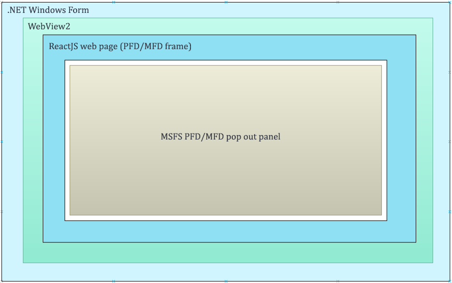
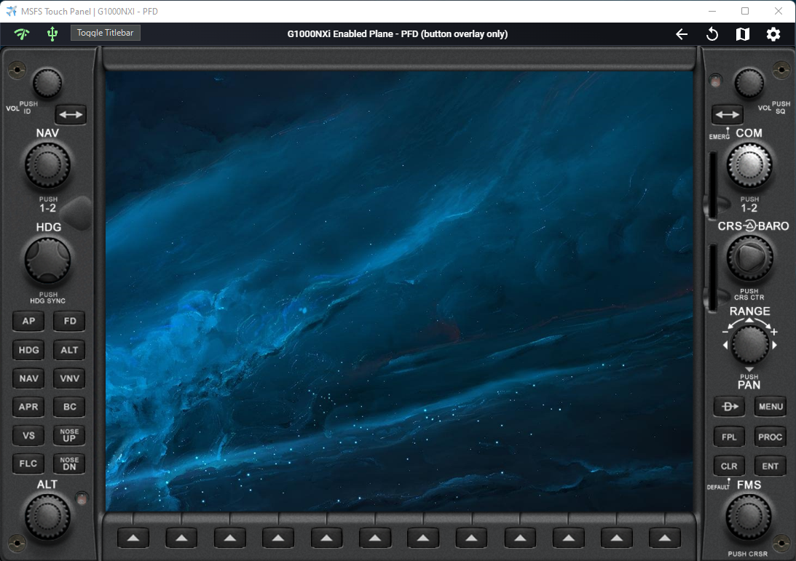
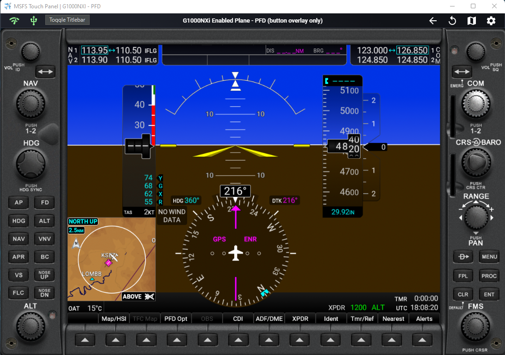
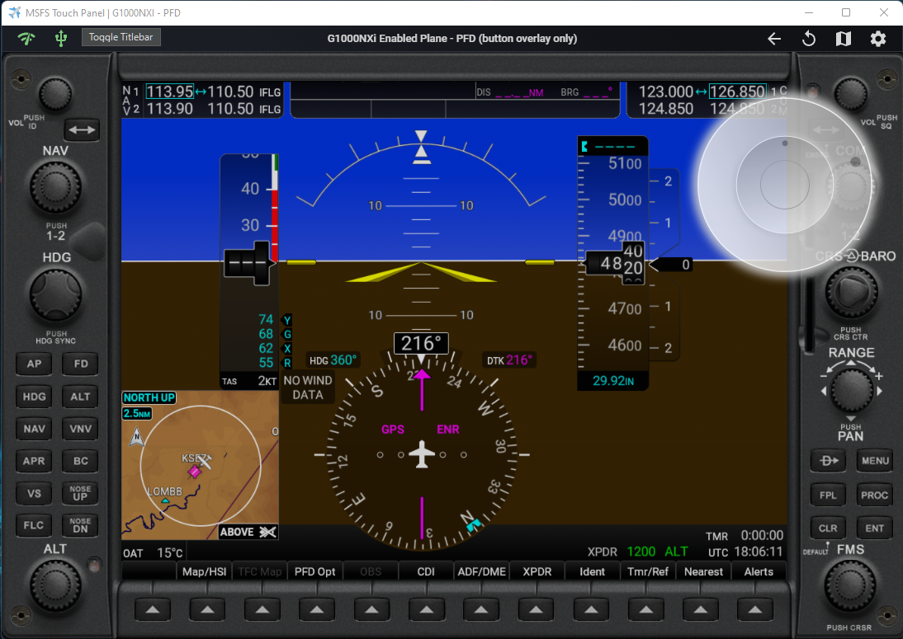
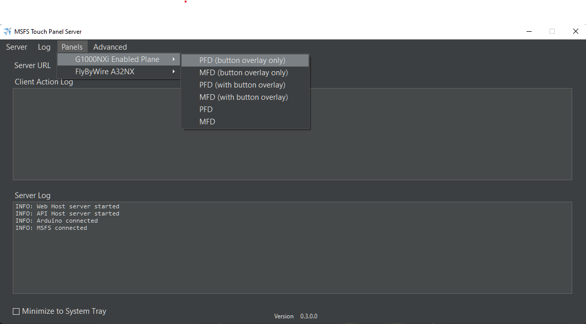

# MSFS Touch Panel Feature #1

# G1000 NXi PFD/MFD Button Bezel Panel

The concept of this feature is to be able to code a responsive web based PFD/MFD control frame using ReactJS which can host pop out panels from MSFS similar to Air Manager. To achieve this, a .NET windows form container uses a webview to host a PDF/MFD control frame. To achieve transparency throughout, the web page, webview and windows form will need to set the correct transparency to allow the PDF/MFD pop out panel to show through. The on screen or arduino rotary encoder input will behave similar to the Knobster by Air Manager. By touching the corresponding dial on PFD/MFD frame, the on screen control or rotary encoder will serve as input for that selected dial.

  
   
    
    

 
 
# How to Use?
1. Launch PFD and/or MFD panel from the server application. (MSFS Touch Panel Server.exe). Select either:
* PFD (button overlay only)
* MFD (button overlay only)

2. Recommendation is to put the PFD/MFD frame on a separate screen, preferable a tablet screen (using tool like [spacedesk](https://www.spacedesk.net/)) or an external touch enabled monitor.

3. Resize or preferably maximize the PFD/MFD frame on the screen. The frame will keep its aspect ratio from the web page responsive design.

4. Pop out corresponding G1000 NXi PFD/MFD panel from the game and move it within the frame. You can use any 3rd party tool or my [pop out manager tool](https://github.com/hawkeye-stan/msfs-popout-panel-manager) to save the pop out location so you don't have to do this on every flight.

5. By default, the knobs in the panel uses on screen control. To use Arduino control for the knobs, press the gear icon in the menu bar, make sure "Use Arduino" is enabled.
 
6. All the buttons on the PFD/MFD frame will now work and behave just like touch enable buttons.

7. You can go back and forth between the touch panel application (ie. to see the moving map) and the pop out frame by pressing the "map" icon in the menu bar.

* For technical / debuggin purpose, you can also access the PFD/MFD bezel panel frame with the following URL in a browser. Replace "Your server ip" with the server ip:

	http://(Your server ip):5000/framepanel/g1000nxi/pfd 

	http://(Your server ip):5000/framepanel/g1000nxi/mfd 

