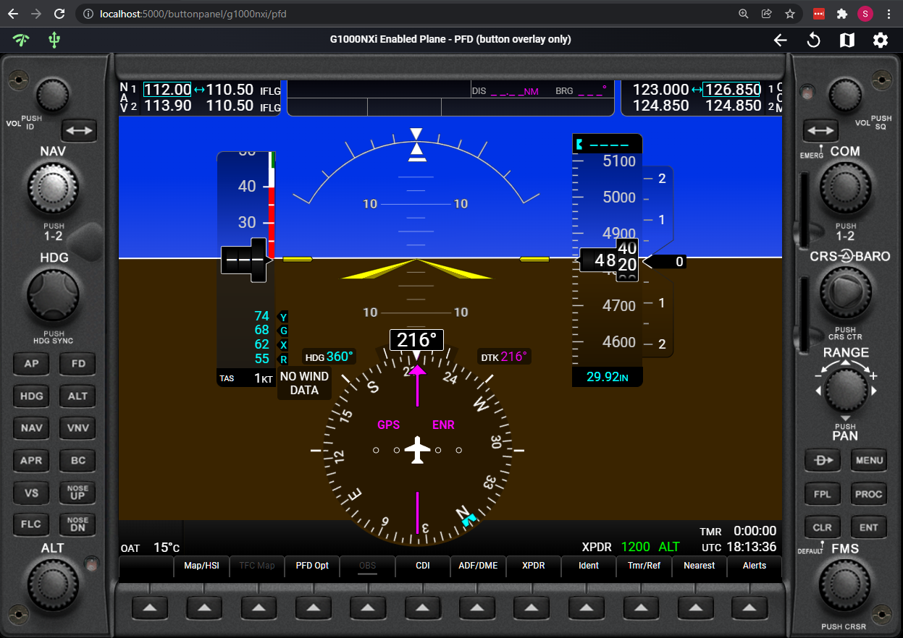
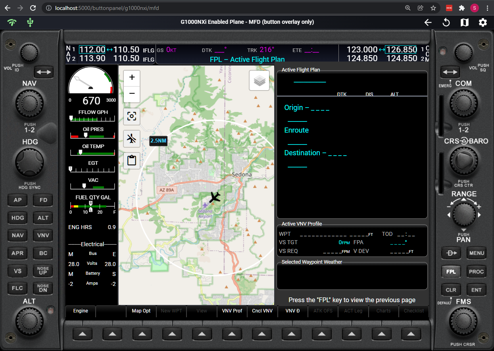
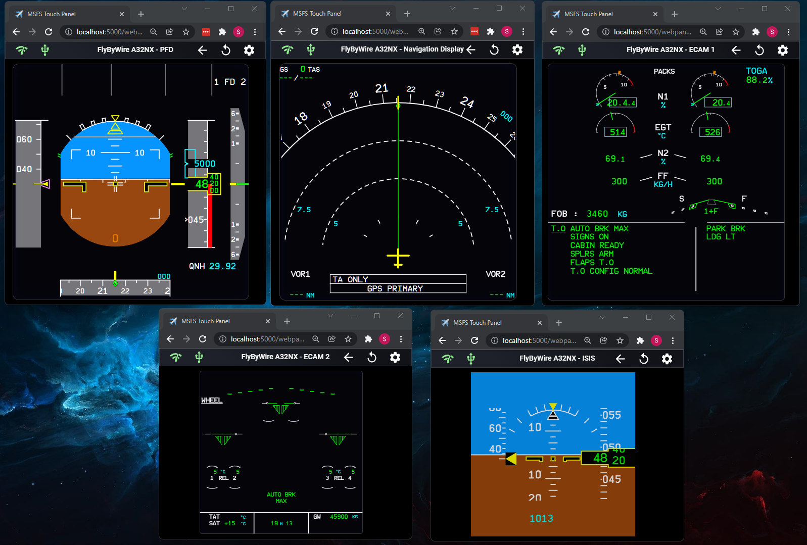
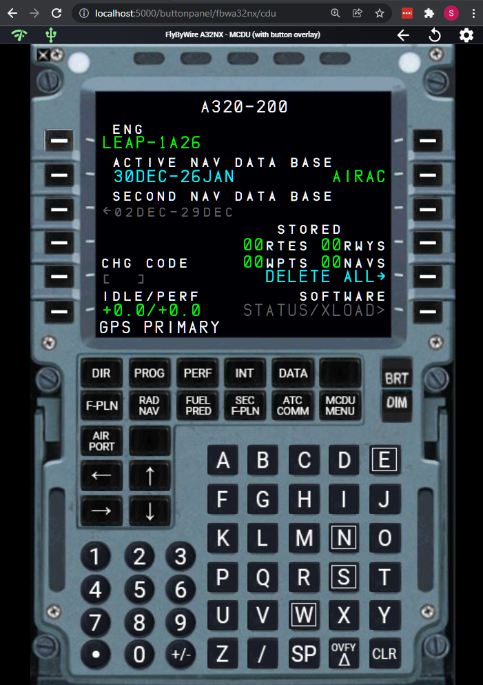
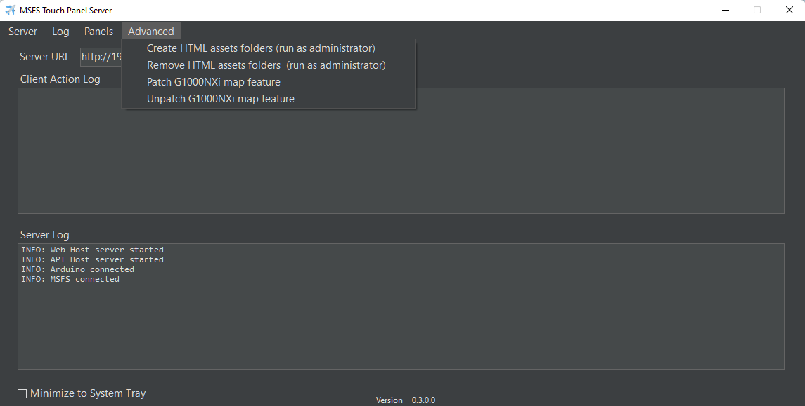
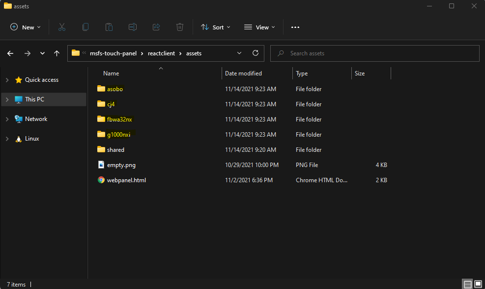
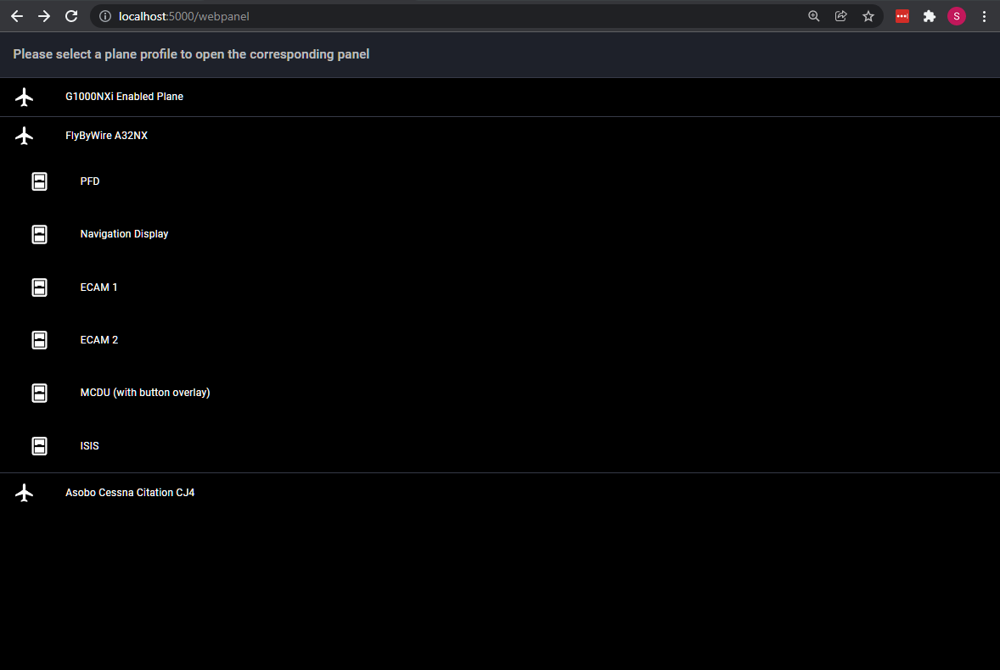
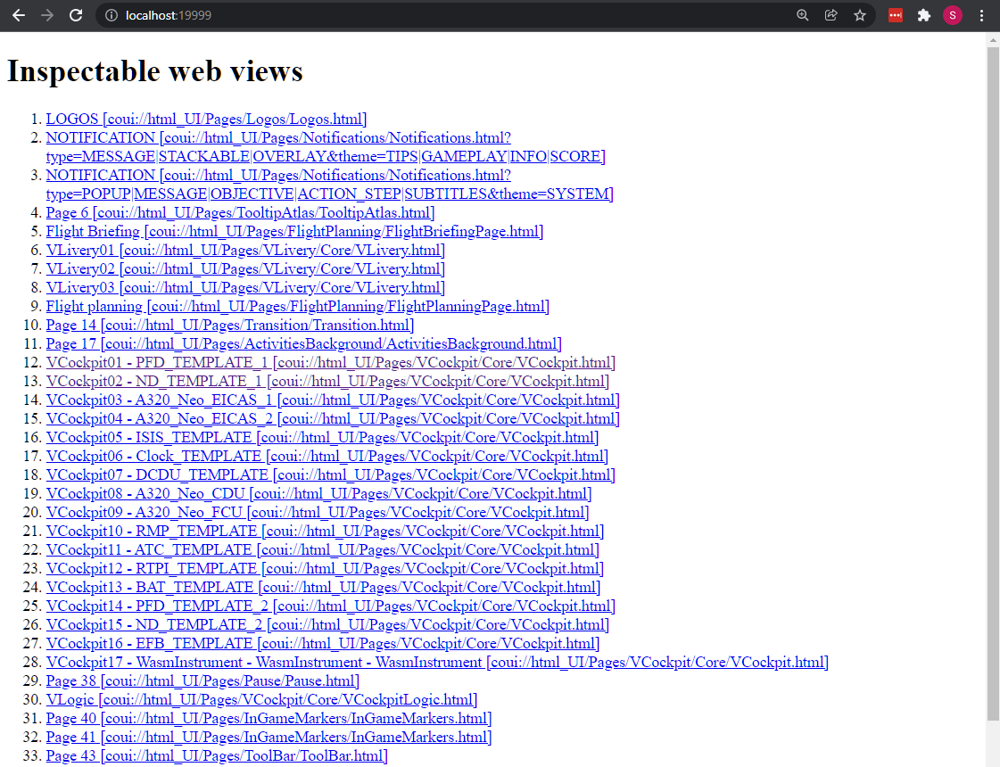

# MSFS Touch Panel Experimental Feature #2
# Proof-of-Concept web-based panel

The panels below are real-time rendering of in-game pop out panels. 

  
   

 

  
   

# Supported Plane

* Planes using G1000 NXi add-on
* FlyByWire A32NX
* Original MSFS Asobo CJ4
 

# How to Install?

To create the replica of the HTML panel, HTML assets for each supported plane has to be referenced in my app. To do this, symbolic folder links are created against certain MSFS game folders for the  HTML_UI assets.

1. Launch MSFS Touch Panel server as administrator. This is important since Windows PowerScript needs administrator access to create symbolic folder links.

2. Select Advanced -> Created HTML assets folders (run as administrator)

  

3. After execution, 4 new folders are created by PowerScript and inside them, you should see symbolic link folders that link to the game folders.

  

### Optional: Additional install for G1000NXi

Because of the lag of ability to pull Bing Map information / HTML canvas information in my app. If you want to see real-time flight plan and waypoints to display on G1000NXi MFD panel, an additional step will be needed.

1. Select Advanced -> Patch G1000NXi map feature

  

2. Restart the flight and waypoints should appear as you enter flight plan information in PFD or MFD panel.

3. Since the patch adds few lines of new code to the G1000NXi addon, you have to repatch it if the plugin is updated.
 

# How to Use?

1. Launch the server application. (MSFS Touch Panel Server.exe)

2. Navigate to the main application at:

	http://(Your server ip):5000
	
3. Click the web panel feature icon

  

4. Select the panel you want to use. You can use multiple browsers to open differnt panel.

  

**IMPORTANT!: Each panel can only open once since CoherentGT only allows one connection to websocket per panel.**

5. Start the game and launch into a flight. 

6. The selected panel should automatically connnects.

7. If panel does not connect, click the "refresh" icon to reload the panel.

# Direct Access to Panels

You can type in following the URL in web browser if you want to access the panel from a different device, just change (Your server ip) to the IP of MSFS Touch panel server address:

* G1000 NXi

	http://(Your server ip):5000/webpanel/g1000nxi/pfd

	http://(Your server ip):5000/webpanel/g1000nxi/mfd
	
	http://(Your server ip):5000/buttonpanel/g1000nxi/pfd

	http://(Your server ip):5000/buttonpanel/g1000nxi/mfd

* G1000 CJ4

	http://(Your server ip):5000/webpanel/cj4/pfd

	http://(Your server ip):5000/webpanel/cj4/mfd
	
	http://(Your server ip):5000/webpanel/cj4/fmc

	http://(Your server ip):5000/webpanel/cj4/sai
	
* FlyByWire A32NX

	http://(Your server ip):5000/webpanel/fbwa32nx/pfd
	
	http://(Your server ip):5000/webpanel/fbwa32nx/nd
	
	http://(Your server ip):5000/webpanel/fbwa32nx/eicas_1

	http://(Your server ip):5000/webpanel/fbwa32nx/eicas_2

	http://(Your server ip):5000/webpanel/fbwa32nx/isis
	
	http://(Your server ip):5000/buttonpanel/fbwa32nx/cdu

If panel screen doesn't come up after a few seconds, please reload the page or see inspector in browser's development panel to see are there any javascript error.	

### OR you can launch the web page inside as an application window

  

 

# Technical Detail

How this feature works is by using Coherent GT debugger that is part of MSFS SDK. (You do not need to install the SDK to use this feature). When MSFS starts, a local Coherent GT debugging port is opened at:

http://localhost:19999		

  

By accessing http://localhost:19999/pagelist.json, you will get a list of current render views with page ID as the game loads. The view will change as you go from screen to screen within the game. 

By implementing code to solve web browser CORS requirement, my app's web link at http://localhost:5000 is able to access debugger's websocket connection at 

ws://localhost:19999/devtools/page/XXX

XXX will be different every time a flight is started.

The websocket returns messages that can be used to recreate the VCockpit HTML page as DOM nodes on demand. By parsing different types of incoming websocket messages, my app is able to reconstruct the entire DOM tree in real-time and render it inside a web browser. Each websocket message has a piece of information with attributes and node relationship for reconstruction. Unfortunately, the reconstruction is not straight forward. Determination of node content, node parsing, bug and performance workaround, as well as one-offs on Asobo's side and 3rd party developer side are needed. Incorrect reconstruction and parsing will usually kill the browser with CPU usage spike and memory leak. 

There are couple things I'm not able to get information currently:

1. Bing Map - HTML image tag with src JS_BINGMAP_XXXXXXXXX are not available since they're not PNG or other image type. Most likely they're stream images on the Coherent server side which gets updated on-demand. The debugger web socket is not able to return this image. 

2. Anything that is drawn in real-time on HTML canvas. 

## Performance

Theoretically, my code can render any view that CoherentGT returns. But when coding this app, I discovered some views are "cleaner" than others. There are views that redraw the same HTML node over and over again without any content changes which kill performance. My believe CoherentGT debugger returns information to help MSFS VCockpit developers to optimize the VCockpit views but some views are not optimized.

If you see a view keeps flashing, it means my app parses a node over and over again with no content change on MSFS side. 
 

## Troubleshooting

1. When things do not work, please try restarting the server or refresh the web panel. This usually fixes the problem.
 

Anyway, it is fun to do this feature even though it is not perfect. But being able to run an entire G1000Nxi PFD with minimal code change other than dumping the html_ui folder into the web app is a win!

Code for this experiment feature, mostly in module.js file is available: [module.js](reactclient/public/assets/shared/module.js) and [webpanel.html](reactclient/public/assets/webpanel.html)