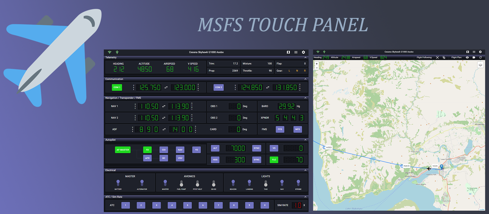
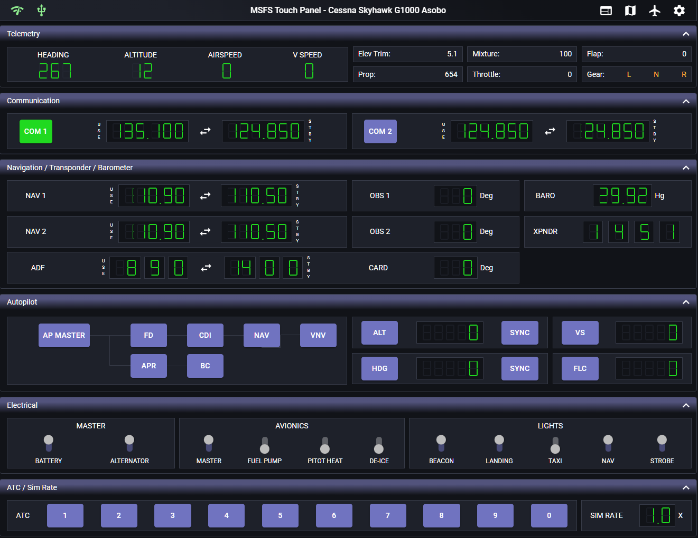
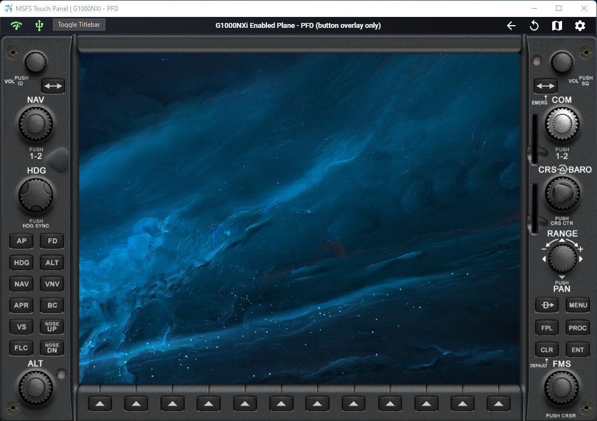
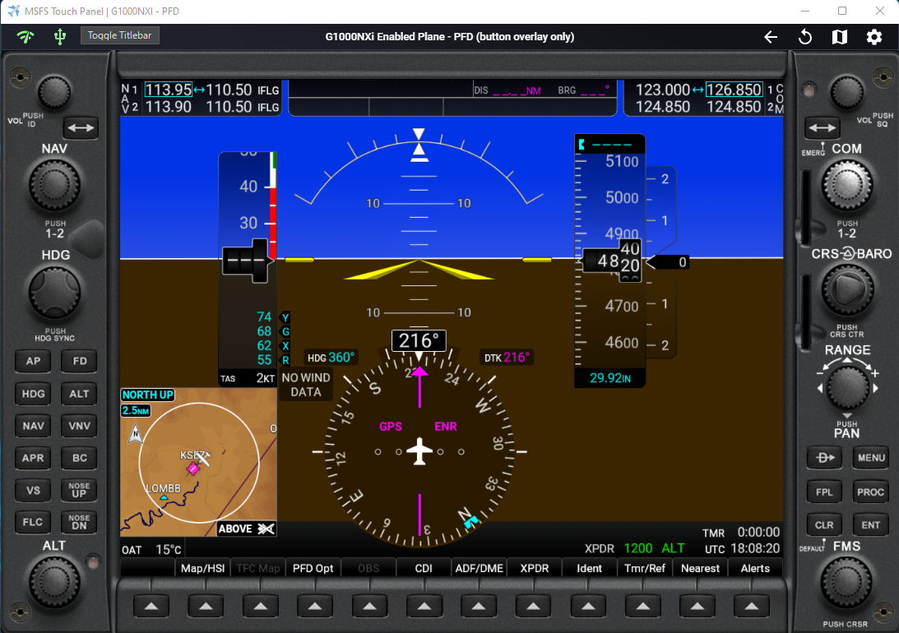
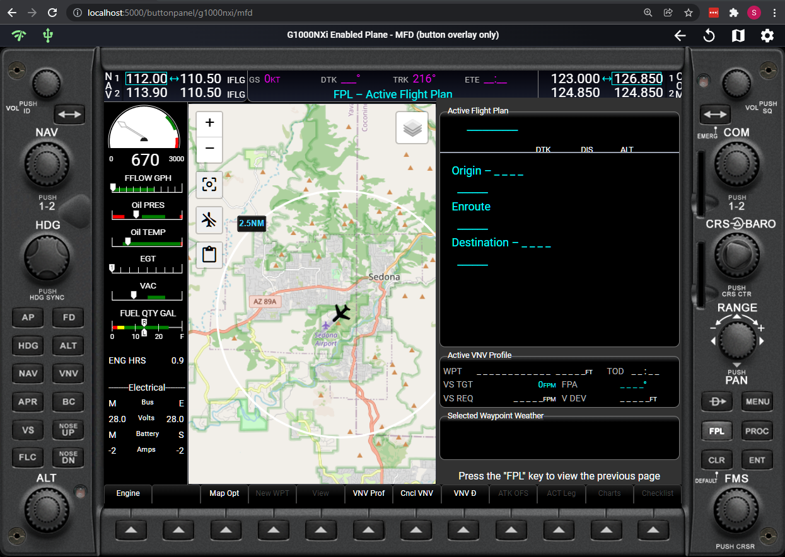
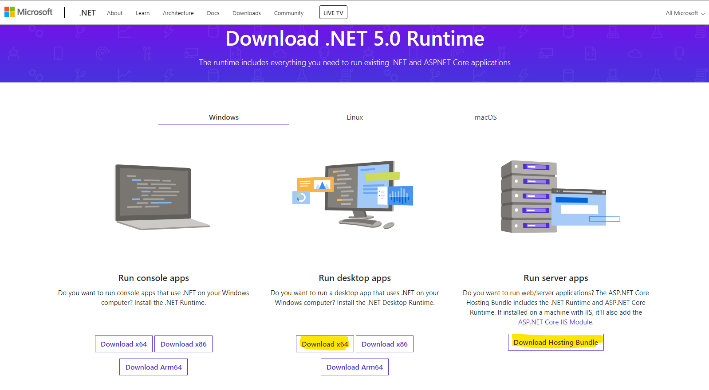
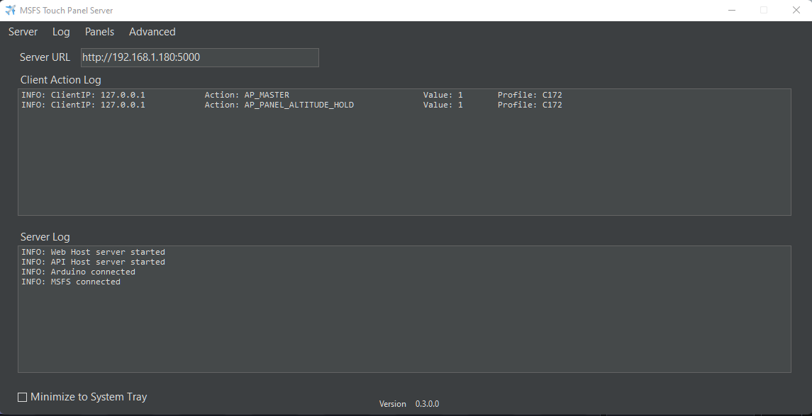

MSFS Touch Panel is a proof-of-concept web application for MSFS 2020 which focuses on touch inputs to make your flying more enjoyable! It is designed for an iPad, Android tablet, or touch screen monitor with Arduino's input controls in mind to provide a simple DIY cockpit for all the casual sim fans out there. This application can also be used in any modern browser on PC or tablet with all features enabled. 

The application contains two major features, a touch panel to control common flight instrumentations and a feature for web-based rendering of in-game pop out panel and provide bezel support for pop out panel.
 

## Touch Panel Feature

 - Input control profiles for (Default plane, C152 and C172 G1000 - using G1000 NXi addon)
 - Flight controls including the following:
	 - Telemetry display
	 - NAV/COM controls
	 - Autopilot controls
	 - Basic electric controls (lights, pito heat / de-ice, power)
	 - ATC menu buttons
	 - Sim rate control
 - Moving map with Open Street Map / Google Map selection
	 - Automatic flight plan loading
 - Configuration settings
	 - Show / hide control panels as you see fit
	 - Customizable data refresh interval for UI controls and maps
	 - Configurable input method
		 - DIY Arduino knob / joystick input (similar to DIY Knobster by Sim Innovations) 
		 - Touch direct input
		 - Touch knob input
 - Server side logging for programmers out there who want to see what is going on behind the scene

  

 
 
This project is developed with ReactJS front-end client and an ASP.NET core 5.0 back-end server application. Feature additions and bug fixes will be ongoing as I learn more about the inner workings of MSFS in order to create more advanced feature set, increase support for various airplane profiles, and continue to improve performance of the application.

 

## Web-based Panel Feature

 - [Feature #1](ExperimentalFeature1.md):  Similar to Air Manager by Sim Innovations, but a web-based G1000 NXi PFD/MFD transparent .NET WebView2 control frame with fully functional touch enabled switches and dials. Manually pop out these 2 panels from the game or use a [tool](https://github.com/hawkeye-stan/msfs-popout-panel-manager) and place them inside these panels to use the active touch screen controls. One way to use this feature is to move the window to a touch screen monitor or tablet using tool such as Spacedesk. Now you've a fully functional G1000 PFD/MFD.
 

  
   

 - [Feature #2 (Experimental)](ExperimentalFeature2.md):  Building on top of experimental feature #1. I reverse engineered MSFS SDK CoherentGTDebugger and used the debugging web socket data messages to reconstruct pop out  panels (vcockpit display) in web browser. Running this particular version of the panel has no minimal FPS penalty compare to pop out panel by using ALT-Right click. One major caveat is that although most items work, Bing Maps are not working. Please see experimental feature documentation for technical detail. One way to use this feature is to open the corresponding web page on a touch screen monitor or tablet browser. Please see documentation for the URLs.  To use this feature, an additional installation step will be needed. Please see [documentation](ExperimentalFeature2.md) for installation instruction.

   
   
   

 

# How to install?
Download the latest release [here](https://github.com/hawkeye-stan/msfs-touch-panel/releases) and unzip the content to a folder of your choice. **The server application must be installed on the PC running MSFS.**

1. After unzipping the content, copy MobilFlight WASM module (within the
    unzipped folder "***plugin-extension/mobiflight-event-module***") to your MSFS Community folder. 

    You will find the community folder under:
    -    *MS Store users*:  C:\Users\YOURUSERNAME\AppData\Local\Packages\Microsoft.FlightSimulator_8wekyb3d8bbwe\LocalCache\Packages
    -   *Steam users*:  
    C:\Users\YOURUSERNAME\AppData\Roaming\Microsoft Flight Simulator\Packages\
  
 2. Download and install latest .NET 5.0 framework if being prompted. You've to install both the x64 desktop app runtime and server app runtime.
 

 

# How to run?
 - Make sure your tablet or browser are connected to the same internal network as the touch panel server application.
 - Run ***MSFS Touch Panel.exe*** within the unzipped folder. This is the server application. You have the option to minimize the server to Windows tray or just run it the background.
 

 - Open a browser from your computer or tablet and enter the IP address given by the server application. It should be something like ***192.168.1.XXXX:5000***. If you're running the client application on the same computer as the server, you can use ***localhost:5000*** as the IP address. 
 
 - The client application will connect and disconnect automatically when you start or quit MSFS.
 - Tips!! For iOS, you can add the browser page to home screen to better utilize the screen real estate by running the application as a full screen app.
 
# What's next for development of this project?
 - Expand support for plane profiles
 - Increase support for plane control functions
 

# Touch Panel User Guide
[User Guide](https://github.com/hawkeye-stan/msfs-touch-panel/blob/master/UserGuide.md)
 

# Web-based Panel Feature Guide
[Feature #1](https://github.com/hawkeye-stan/msfs-touch-panel/blob/master/ExperimentalFeature1.md)

[Feature #2 (Experimental)](https://github.com/hawkeye-stan/msfs-touch-panel/blob/master/ExperimentalFeature2.md)
 

# Technical Detail
[Technical Detail](https://github.com/hawkeye-stan/msfs-touch-panel/blob/master/TechnicalDetail.md)
  

# Author
Stanley Kwok
[hawkeyesk@outlook.com](mailto:hawkeyesk@outlook.com)
 

# Credits

 - [MSFS Mobile Companion App](https://flightsim.to/file/2828/msfs-mobile-companion-app) for inspiration of creating this application!
 - [MobiFlight Connector](https://www.mobiflight.com/en/index.html/) to access HVar/Lvar values that are not available by SimConnect
 - React components and algorithms:
	 - [Seven segment display bit based algorithm example](http://www.uize.com/examples/seven-segment-display.html) by Chris van Rensburg
	 - [Seven segment display initial code base](https://github.com/z0h4n/react-seven-segment-display) by Mazhar Shaikh
	 - [React dial knob component](https://github.com/pavelkukov/react-dial-knob) by Pavel Kukov
	 - [Leaflet library](https://leafletjs.com/) by Vladimir Agafonkin
	 - [Leaflet curve library](https://github.com/elfalem/Leaflet.curve) by elfalem
	 - [React-leaflet component](https://github.com/PaulLeCam/react-leaflet) by Paul Le Cam
- [Working Title G1000 NXi addon](https://www.workingtitle.aero/packages/nxi/)
- [Original Images for Experimental G1000 Panel Background](https://github.com/jplewis01/G1000-AirMgr_Panel/) by jplewis01

